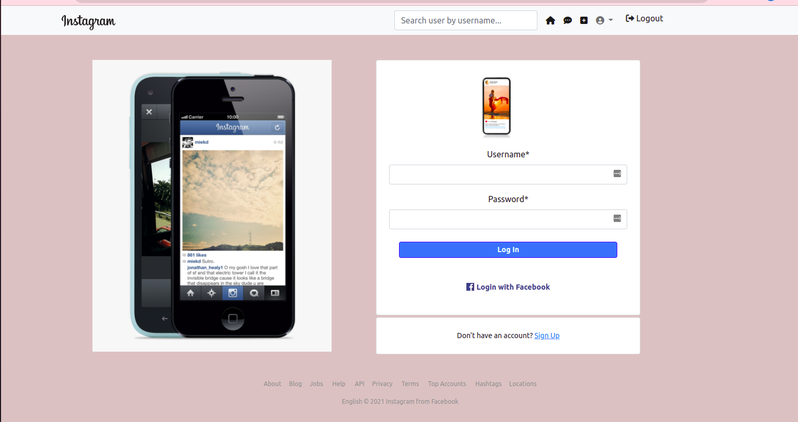

# Instagram_app
## Description
   Instagram clone application .Users can post photos,like and comment on other users photo.

## By Caren Chepkorir

 

## BDD
A user of the application should be able to:
    Sign in to the application to start using. 
    Upload my pictures to the application. 
    See my profile with all my pictures. 
    Follow other users and see their pictures on my timeline. Like a picture and leave a comment on it.

## Getting Started
  To get a copy of the project up and running on your local machine for development and testing purposes, clone this repository into a virtual environment and install the package manager, pip. 
  See deployment for notes on how to deploy the project on a live system.
## Prerequisites
Use the package manager pip to install all project requirements.

    (virtual) $ pip install -r requirements.txt

## Technologies used
 *Django 
 *Python3 
 *Bootstrap4
 *Html

## Installing
To get a development env running, use the .env.example file to create a .env file with appropriate values

## Running the tests
Run automated tests for this system

  (virtual) $ python3 manage.py test instagram

## Deployment
    With all environment variables changed to suit your local copy of this repository, deploy the application to [Heroku] to see it live or simply run it locally (virtual) $ python3.8 manage.py runserver

## License
  MIT LICENSE  Copyright <2022> <CAREN CHEPKORIR>.Permission is hereby granted, free of charge, to any person obtaining a copy of this software and associated documentation files (the "Software"), to deal in the Software without restriction, including without limitation the rights to use, copy, modify, merge, publish, distribute, sublicense, and/or sell copies of the Software, and to permit persons to whom the Software is furnished to do so, subject to the following conditions: The above copyright notice and this permission notice shall be included in all copies or substantial portions of the Software. THE SOFTWARE IS PROVIDED "AS IS", WITHOUT WARRANTY OF ANY KIND, EXPRESS OR IMPLIED, INCLUDING BUT NOT LIMITED TO THE WARRANTIES OF MERCHANTABILITY, FITNESS FOR A PARTICULAR PURPOSE AND NONINFRINGEMENT. IN NO EVENT SHALL THE AUTHORS OR COPYRIGHT HOLDERS BE LIABLE FOR ANY CLAIM, DAMAGES OR OTHER LIABILITY, WHETHER IN AN ACTION OF CONTRACT, TORT OR OTHERWISE, ARISING FROM, OUT OF OR IN CONNECTION WITH THE SOFTWARE OR THE USE OR OTHER DEALINGS IN THE SOFTWARE.
